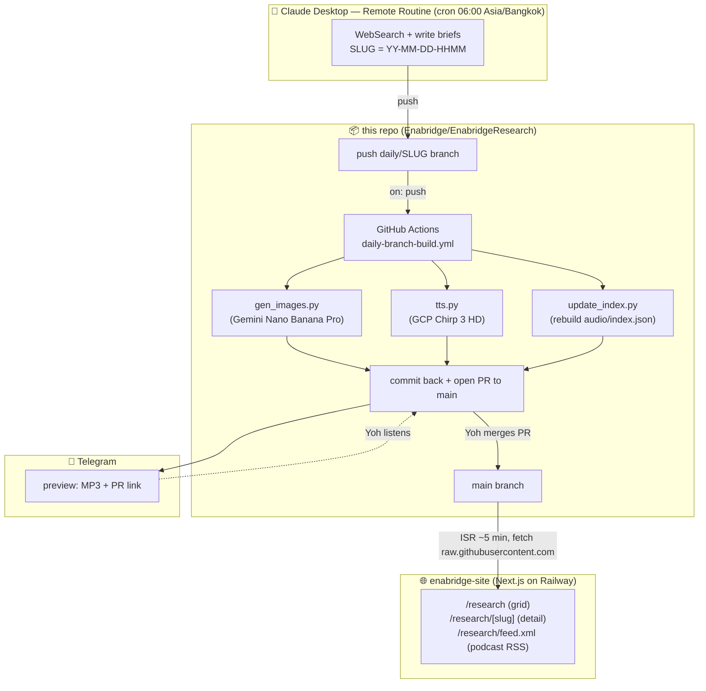

# enabridge-research

Daily AI research brief pipeline สำหรับทีม Enabridge / OpenBridge

**โฟกัส:** Agentic AI · Real-world AI business use cases (ของจริง มีตัวเลข) · OpenBridge-relevant trends

**ผลลัพธ์:** [enabridge.ai/research](https://enabridge.ai/research) — web + podcast feed, อัปเดตอัตโนมัติทุกเช้า 06:00 Asia/Bangkok

---

## How it works

ทุกเช้า Claude Code Remote Routine ค้นข่าว เขียน brief + push branch → GitHub Actions ทำ images + audio + PR + Telegram preview → Yoh ฟัง + approve → `enabridge-site` ขึ้น episode ใหม่ภายใน 5 นาที



**Text-only timeline:**

```
  06:06  routine wakes → writes 3–5 briefs → push daily/SLUG branch
    ↓
  06:07  GHA runs (~3–5 min): images + audio + index + PR + Telegram preview
    ↓
  06:10  📱 Telegram: MP3 + PR link
    ↓
  (any) 🎧 Yoh listens on Telegram/Apple Podcasts → clicks PR → approves → merges
    ↓
  +5 min enabridge.ai/research ขึ้น episode ใหม่ (ISR revalidation)
```

---

## End-to-end components

Pipeline กินขอบเขต 4 ระบบ — เอกสารนี้ครอบคลุมส่วนที่เป็น repo; ส่วนอื่น ๆ ต้อง config นอก repo:

| # | Component | ทำอะไร | Lives where | Setup ref |
|---|---|---|---|---|
| 1 | **Claude Desktop — Remote Routine** | Cron รันทุกเช้า WebSearch + write briefs + push branch | [code.claude.com/routines](https://code.claude.com/routines) | § 1 ด้านล่าง |
| 2 | **This repo** (`Enabridge/EnabridgeResearch`) | เก็บ briefs + audio + images; GHA pipeline | GitHub | § 2 ด้านล่าง |
| 3 | **Telegram bot** | ส่ง MP3 + PR link ให้ review | BotFather + user chat | § 3 ด้านล่าง |
| 4 | **`enabridge-site`** (separate repo) | Next.js app; fetch feed + display web + podcast RSS | Railway | § 4 ด้านล่าง |

---

## First-time setup (one-time, across systems)

### § 1. Set up Remote Routine ใน Claude Desktop

1. เปิด [code.claude.com/routines](https://code.claude.com/routines) (หรือ Claude Desktop → Settings → Routines)
2. **Connect repo**: `Enabridge/EnabridgeResearch`
3. **Schedule**: `0 6 * * *` timezone `Asia/Bangkok` (= 06:00 ไทย ทุกวัน)
4. **Secrets** (inject เป็น env var ใน routine sandbox):
   - `TELEGRAM_BOT_TOKEN`
   - `TELEGRAM_CHAT_ID`
   - (image gen + TTS รันบน GHA — routine ไม่ต้องมี GEMINI_API_KEY / GOOGLE_APPLICATION_CREDENTIALS)
5. **Routine prompt**: copy จาก [`prompts/daily-research.md`](prompts/daily-research.md)
6. **Permissions**: Bash, WebSearch, WebFetch, file read/write
7. **Git write access**: routine ต้อง push ได้ — Claude Code web ใช้ GitHub App integration (ตั้งค่าอัตโนมัติจาก "Connect repo")
8. Save → กด **"Run now"** ทดสอบครั้งแรก

รายละเอียดเต็ม: [`PHASE3-SETUP.md`](PHASE3-SETUP.md) § 4

### § 2. Configure ENV — GitHub Actions secrets

ไปที่ `https://github.com/Enabridge/EnabridgeResearch/settings/secrets/actions` → **New repository secret**:

| Key | Value | ใช้ทำอะไร |
|---|---|---|
| `GEMINI_API_KEY` | `AIza...` (จาก [Google AI Studio](https://aistudio.google.com/apikey)) | Gemini Nano Banana Pro image gen |
| `GCP_TTS_SA_JSON` | **base64** ของ service-account JSON (role: `Cloud Text-to-Speech User`) | Google Cloud TTS Chirp 3 HD |
| `TELEGRAM_BOT_TOKEN` | จาก `@BotFather` | ส่ง preview หลัง GHA เสร็จ |
| `TELEGRAM_CHAT_ID` | user ID ของ Yoh (ได้จาก `scripts/telegram_setup.py`) | destination ของ Telegram preview |

> Encode SA JSON: `base64 -i gcp-tts-sa.json | pbcopy` (macOS) — paste ค่าเข้า GitHub secret ตรง ๆ
> ถ้ายัง keep `OPENAI_API_KEY` ไว้สำหรับ rollback ก็ปล่อยไว้ได้ — workflow ปัจจุบันไม่ใช้แล้ว

**Workflow permissions**: `Settings → Actions → General` →
- เลือก **"Read and write permissions"**
- ติ๊ก **"Allow GitHub Actions to create and approve pull requests"**

รายละเอียดเต็ม: [`PHASE3-SETUP.md`](PHASE3-SETUP.md) § 1–2

### § 3. Telegram bot + approval flow

1. คุย `@BotFather` → `/newbot` → copy token → เก็บเป็น `TELEGRAM_BOT_TOKEN`
2. ส่งอะไรก็ได้ให้ bot (พิมพ์ `/start`) แล้วรัน `python3 scripts/telegram_setup.py` → จะบอก `chat_id` ของคุณ → เก็บเป็น `TELEGRAM_CHAT_ID`
3. **Approval flow** (ทุกวัน):
   - 06:10 — bot ส่ง message + MP3 + PR link เข้า Telegram
   - 🎧 Yoh ฟัง MP3 ใน Telegram (หรือ Apple Podcasts ถ้า subscribe feed ไว้)
   - 🔗 ถ้า OK → กด PR link → **Merge pull request** บน GitHub
   - ถ้าไม่ OK → close PR หรือ push เพิ่มใน branch เดิม (GHA จะ rebuild + update Telegram preview)

### § 4. `enabridge-site` — consume feed from this repo

Site fetches content จาก `raw.githubusercontent.com/Enabridge/EnabridgeResearch/main` (ไม่ต้อง sync/mirror ไฟล์)

**Railway env vars** (project `enabridge-site` → service → Variables):

| Key | Value |
|---|---|
| `GITHUB_OWNER` | `Enabridge` (case-sensitive) |
| `GITHUB_REPO` | `EnabridgeResearch` (case-sensitive) |
| `GITHUB_BRANCH` | `main` |

Site จะ:
- อ่าน `audio/index.json` → render `/research` (grid ของ 60 episode ล่าสุด)
- อ่าน `news/SLUG-*.md` + images → render `/research/[slug]`
- Generate `/research/feed.xml` — podcast RSS มาตรฐาน
- ISR revalidate ทุก 5 นาที → merge PR แล้ว 5 นาที site ขึ้นของใหม่

**Subscribe podcast:**
- **Apple Podcasts**: Library → Follow Show by URL → `https://enabridge.ai/research/feed.xml`
- **Spotify**: submit feed ที่ [podcasters.spotify.com](https://podcasters.spotify.com/) (review 1–2 วัน)
- **Overcast / Pocket Casts / ฯลฯ**: "Add by URL"

รายละเอียดเต็ม: [`MIGRATION.md`](MIGRATION.md) § Step 2 + Step 6

---

## Slug format — `YY-MM-DD-HHMM`

Timestamp ของรอบรัน (Asia/Bangkok):

- `26-04-21-0606` = 21 เม.ย. 2026, 06:06 (รอบเช้า scheduled)
- วันเดียวรัน adhoc เพิ่มได้ — ไม่ทับกัน เช่น `26-04-21-1430`
- Branch convention: `daily/${SLUG}` — **1 branch = 1 รอบ = 1 episode**

---

## Repository layout

```
enabridge-research/
├── news/
│   ├── SLUG-NN-slug.md                 # individual brief (e.g. 26-04-21-0606-01-adobe-cx.md)
│   ├── SLUG-index.md                   # round-level theme + TL;DR
│   └── images/SLUG-NN-slug.png         # Gemini Nano Banana Pro hero image (GHA-generated)
├── audio/
│   ├── SLUG.mp3                        # TTS output (GHA-generated)
│   ├── SLUG.txt                        # TTS script source
│   ├── SLUG.json                       # per-episode metadata
│   └── index.json                      # feed source of truth (rebuilt by GHA)
├── prompts/
│   └── daily-research.md               # canonical routine prompt (= § 1 setup)
├── templates/
│   └── brief.md                        # brief skeleton
├── scripts/
│   ├── write_briefs.sh                 # routine's final step — branch + commit + push
│   ├── gen_images.py                   # Gemini Nano Banana Pro (GHA)
│   ├── tts.py                          # Google Cloud TTS Chirp 3 HD (GHA)
│   ├── update_index.py                 # rebuild audio/index.json (GHA)
│   ├── push_telegram.py                # Telegram notification (GHA)
│   ├── telegram_setup.py               # one-time: discover chat_id
│   └── run_daily.sh                    # legacy local-mode orchestrator (backup)
├── .github/workflows/
│   └── daily-branch-build.yml          # the pipeline
├── config.json                         # topics + delivery config
└── README.md                           # this file
```

---

## Brief structure

แต่ละ `news/SLUG-NN-slug.md` (ดู `templates/brief.md` สำหรับ skeleton เต็ม):

```yaml
---
title: ...
topic: agentic-ai | use-case | openbridge-trend
image_prompt: |
  EN, 3–5 ประโยค, story-driven hero illustration:
  story beat + visual metaphor + composition + style.
  Logos OK, text rendering OK (อ่านออกใน 200px thumbnail),
  1:1 aspect, no real human faces (silhouette OK).
image:                                   # GHA เติมให้
source_url: https://...
---
```

- **3–5 ย่อหน้า story-driven** — "เกิดอะไรขึ้น" + "ทำไมสำคัญ" + "มุม OpenBridge"
- **`## Audio script`** — text ที่จะถูกแปลงเป็น TTS

Round-level `news/SLUG-index.md` = theme + รายการทุก brief + TL;DR 3–4 บรรทัด

---

## Daily routine — what Claude Code does every morning

Canonical prompt อยู่ที่ [`prompts/daily-research.md`](prompts/daily-research.md). สรุปสั้น:

1. **Setup**: `SLUG=$(date +%y-%m-%d-%H%M)` → `git checkout -b "daily/${SLUG}"`
2. **Research**: WebSearch ข่าว 24–48 ชม. ที่ผ่านมา — signal > noise, 3–5 เรื่องคุณภาพพอ
3. **Write**: `news/${SLUG}-NN-slug.md` แต่ละเรื่อง + `news/${SLUG}-index.md`
4. **Push**: `bash scripts/write_briefs.sh "${SLUG}"` → GHA รับช่วงต่อ
5. **หยุด** — ห้าม merge PR เอง, ห้ามรัน TTS/Telegram/update_index เอง

---

## Local dev

```bash
# Dependencies (macOS with system Python)
pip3 install google-genai google-cloud-texttospeech python-dotenv requests 'httpx[socks]' --break-system-packages

# Simulate a routine run locally
#   - .env needs GEMINI_API_KEY for image gen
#   - .env needs GOOGLE_APPLICATION_CREDENTIALS=/path/to/sa.json for TTS
SLUG=$(TZ=Asia/Bangkok date +%y-%m-%d-%H%M)
git checkout main && git pull
git checkout -b "daily/${SLUG}"
# … write news/${SLUG}-NN-*.md + news/${SLUG}-index.md manually …
bash scripts/write_briefs.sh "${SLUG}"
# GHA picks up from here
```

**Backfill a missed day:** GitHub → Actions tab → re-run workflow on an existing `daily/*` branch, หรือสร้าง branch ย้อนหลังแล้ว push

---

## Cost (daily run, 4 briefs)

| Item | Cost |
|---|---|
| Gemini 3 Pro Image (Nano Banana Pro) 1K × 4 | ~$0.54 (≈ $0.134/image) |
| Google Cloud TTS Chirp 3 HD ~6k chars | ~$0.18 (≈ $30/1M chars) |
| Claude Code routine | Pro plan (no extra) |
| GitHub Actions | Free (public repo) |
| **Monthly total** | **~$22** |

> Trade-off: ภาพดีขึ้นมาก (รองรับ logo/text/composition จริง) + เสียงไทยธรรมชาติขึ้น แลกกับค่าใช้จ่ายเพิ่ม ~3× จาก stack OpenAI เดิม
> ลดได้ถ้าเปลี่ยนเป็น `gemini-2.5-flash-image` (fallback model) — ถูกกว่ามาก แต่คุณภาพต่ำลง

---

## Related

- **`enabridge-site`** (consumer) — Next.js on Railway — fetches briefs + audio จาก `raw.githubusercontent.com/Enabridge/EnabridgeResearch/main` via ISR
- [`prompts/daily-research.md`](prompts/daily-research.md) — canonical routine prompt (source of truth)
- [`PHASE3-SETUP.md`](PHASE3-SETUP.md) — current setup guide (review-before-publish pipeline)
- [`MIGRATION.md`](MIGRATION.md) — Phase 2 → 3 migration history
- [`RUNBOOK.md`](RUNBOOK.md) — ops + troubleshooting
- [`PHASE2-PLAN.md`](PHASE2-PLAN.md) — historical, kept for context
